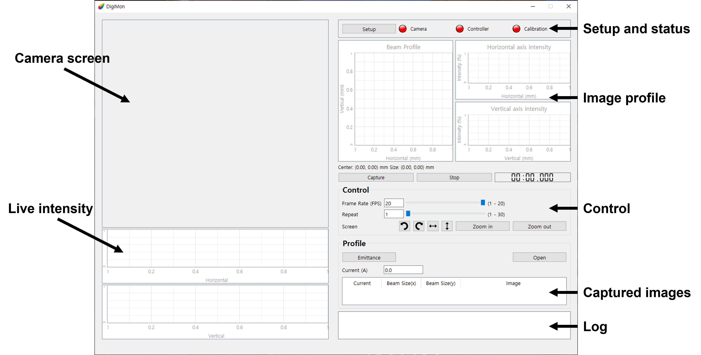

Digital Camera Monitoring System
-------------

Digital Camera Monitoring System(DigiMon) is a program that measures the transverse profile of a beam using the camera.

Korean manual: [Korean](https://github.com/Somhammer/DigiMon/blob/master/README_KR.md)

English manual: [English](https://github.com/Somhammer/DigiMon/blob/master/README.md)

### Download and Installation

The newest program can be downloaded in the [release](https://github.com/Somhammer/DigiMon/releases) section of the repository.
Download it for your operating system and install software of the camera corporations like Basler and Allied Vision then you can use the program. 
If you download a source file, many libraries should be needed additionally.

#### Pylon

DigiMon uses Pylon 6.2.0. [Download](https://www.baslerweb.com/en/sales-support/downloads/software-downloads/) and install it for your operating system.
If your operating system is Linux, add the PYLON_ROOT environment parameter. The value of the parameter is the location of installation(ex: /home/seohyeon/pylon).

#### Vimba

DigiMon uses Vimba 5.0. [Download](https://www.alliedvision.com/en/products/vimba-sdk/#c1497) and install it for your operating system.
If your operating system is Window, add the VIMBA_HOME environment parameter. The value of the parameter is the location of installation(ex: C:\Program Files\Allied Vision\Vimba_5.0).

The DigiMon can be operated neither two software are installed, but GigE camera of each corporation cannot be connected. Please install the software that you need.

#### Source

If you want to download the source file you can download it on the [release](https://github.com/Somhammer/DigiMon/releases) page or git clone.
```
git clone https://github.com/Somhammer/DigiMon.git
```

The DigiMon requires python 3.8 or aboved. And as in the previous case(binary installation) pylon and vimba are needed.
Also, such libraries are required.

- PySide6 >= 6.1.2
- pyqtgraph >= 0.12.2
- colour >= 0.1.5
- matplotlib >= 3.4.2
- numpy >= 1.21.1
- scipy >= 1.7.1
- PyYAML >= 5.3.1
- cv2 >= 4.5.3.56
- pypylon >= 1.7.2.dev4
- VimbaPython >= 1.1.0

After the above libraries are installed using pip, you can run by
```
python DigiMon.py
```

### Browsing
#### Main

</img>

1. Camera Screen
#### Setup
#### Emittance
