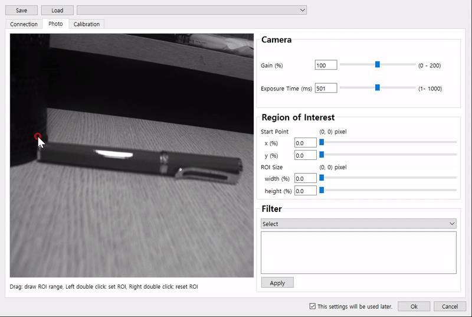
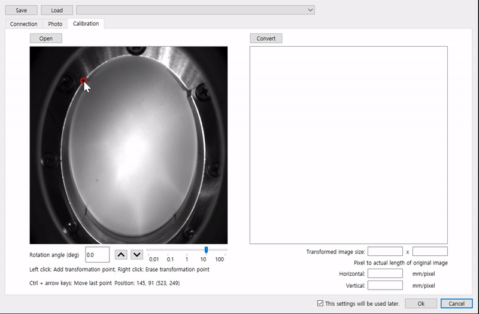
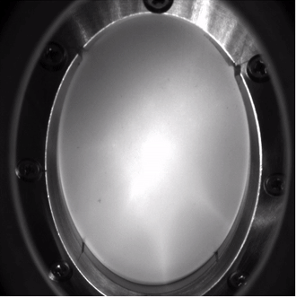
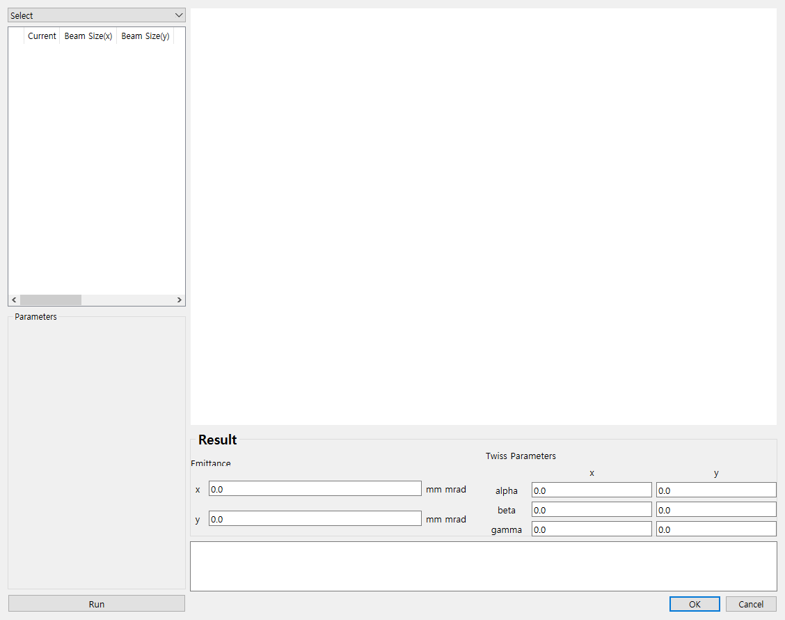
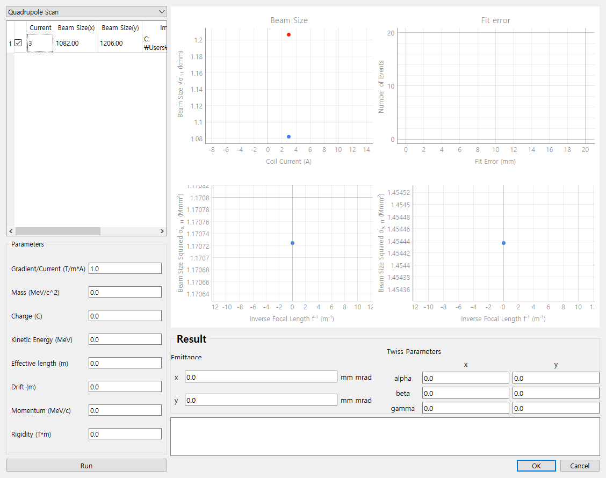

Digital Camera Monitoring System
-------------

Digital Camera Monitoring System(DigiMon) is a program that measures the transverse profile of a beam using the camera.

Korean manual: [Korean](https://github.com/Somhammer/DigiMon/blob/master/README_KR.md)

English manual: [English](https://github.com/Somhammer/DigiMon/blob/master/README.md)
(English Manual is expired.)
### Authors
- Seohyeon An(san@ncc.re.kr)
- Garam Hahn(garam@postech.ac.kr)

### Download and Installation

The newest program can be downloaded in the [release](https://github.com/Somhammer/DigiMon/releases) section of the repository.
Download it for your operating system and install software of the camera corporations like Basler and Allied Vision then you can use the program. 
If you download a source file, many libraries should be needed additionally.

#### Pylon

DigiMon uses Pylon 6.2.0. [Download](https://www.baslerweb.com/en/sales-support/downloads/software-downloads/) and install it for your operating system.
If your operating system is Linux, add the PYLON_ROOT environment parameter. The value of the parameter is the location of installation(ex: /home/seohyeon/pylon).

#### Vimba

DigiMon uses Vimba 5.0. [Download](https://www.alliedvision.com/en/products/vimba-sdk/#c1497) and install it for your operating system.
If your operating system is Window, add the VIMBA_HOME environment parameter. The value of the parameter is the location of installation(ex: C:\Program Files\Allied Vision\Vimba_5.0).

The DigiMon can be operated neither two software are installed, but GigE camera of each corporation cannot be connected. Please install the software that you need.

#### Source

If you want to download the source file you can download it on the [release](https://github.com/Somhammer/DigiMon/releases) page or git clone.
```
git clone https://github.com/Somhammer/DigiMon.git
```

The DigiMon requires python 3.8 or aboved. And as in the previous case(binary installation) pylon and vimba are needed.
Also, such libraries are required.

- PySide6 >= 6.1.2
- pyqtgraph >= 0.12.2
- colour >= 0.1.5
- matplotlib >= 3.4.2
- numpy >= 1.21.1
- scipy >= 1.7.1
- PyYAML >= 5.3.1
- cv2 >= 4.5.3.56
- pypylon >= 1.7.2.dev4
- VimbaPython >= 1.1.0

After the above libraries are installed using pip, you can run by
```
python DigiMon.py
```

### Browsing
#### Main

</img>

1. Camera Screen

After connecting the camera, a live streaming video appears here. You can change the frame on the control panel.
I the video, a green cross-hair is shown which is the point you want to watch the light intensity. 
It can be changed if you click and drag the point of cross-hair.

2. Live intensity

It shows the light intensity of the pixel area which you selected on the screen.

3. Setup and status

By clicking the setup button, you can connect the camera, set capturing option, ROI, and filter, and calibrate the camera image.
The left side of the setup button shows the status of each.
For example, if the camera is connected successfully, the camera light turns green.

4. Image profile

If you take a picture, the profile of the picture is shown here.

5. Control

In the control panel, you can set the frame of the video and how many times you capture the photo.
And arrow buttons are rotating or flipping the image.
The zoom-in and zoom-out buttons zoom in or zoom out the video. 
Because they do not control the camera lens but move the controller, you can use these buttons when the controller is activated.

And you can capture the image by clicking the capture button and stop by clicking the stop button.

6. Captured images(Profile)

In the profile panel, captured imaes are listed in the table and by clicking the emittance button, you can measure the emittance.
If you want to load other images, click the open button.
Also, the current of the quadrupole when you did capture is written by writting the current in the current box or double clicking and writting the current in table. 

- Example after the camera connection

</img>

#### Setup

</img>

If you open a setup window by clicking the setup button, connection, photo, and calibration tabs are shown.
And the above tab, save and load buttons are in.
You can save the setup after finishing the setup and you can load the setup made before.
Setup files in the setup folder are automatically added in the combo box beside the load button.
Also, if the check box on the bottom side is checked, this setup is saved as the 'last.yaml' in the setup folder and you can load it next time.

Now let us take a look at each tab.

You can connect the camera and the device that remotely adjusts the camera position (NCC builds a server that receives signals on the Raspberry Pi) which are called the controller hereinafter. The controller is optional.

The DigiMon search and connect the camera if you choose the SDK to fit the product and click connect button.
But if you use OpenCV, you must write the URL.
If the connection is succeeded, the connect check box is checked.

- Example 1. Android camera

IP webcam application is used.

</img>

- Example 2. Basler CCD camera

acA 1600-20gm CCD camera is used.

</img>

(Allied vision camera is not tested yet)

In the controller case, check the 'Use Network Camera Control Server' and write IP and port number and click connect button.

</img>


If the camera connection is succeeded, a picture is shown captured by the connected camera in the photo tab.
In the photo tab, you can set the gain, exposure time, ROI, and filter.
In the ROI case, you can choose the region by clicking and dragging on the picture window or moving the ROI sliders.
After choosing the region, it can be applied by double-clicking the picture.

</img>

The sliders can be moved by pressing the arrow keys and the default unit is 0.1 % but if Ctrl button is pressed the unit is 1% and if Shift button is pressed the unit is 10%.

To apply the filter, choose the filter and write the parameters then click the apply button.

In the calibration tab, you can convert the tilted photo to a flat photo using the rotation and the perspective transformation and can set the real length per pixel.

By the open button, you can load the image for the calibration and can rotate the image by clicking the up down button below the image.

</img>

For the perspective transformation, you should click the four points and press the convert button.
The points which are chosen convert to the vertext of the purple rectangle. Also, the area of the rectangle is determined in the transform image size box. If you do not write anything in there, the area is determined the length between each point(horizontal length is upper two points, vertical length is left two points).

</img>

The point for the transformation is made by left-clicking and removed by right-clicking and moved per 1 pixel unit by Ctrl + arrow button.

</img>

After completing the calibration, press the ok button to display the video in the main window.

#### Emittance

</img>

You can measure the emittance in above window.
To measure it, first, select the method(now only quadrupole scan method is implemented) then the parameters and some graphs are shown.

</img>

Push the run button after typing parameters into then the emittance and twiss parameters are calculated.
If calculating is fails, an error message is shown in the log and every value is shown as 0.0.
