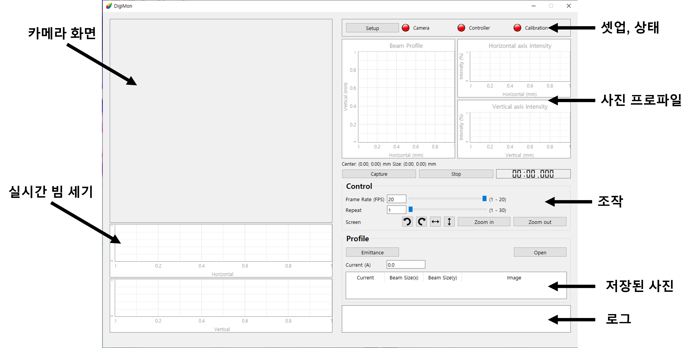
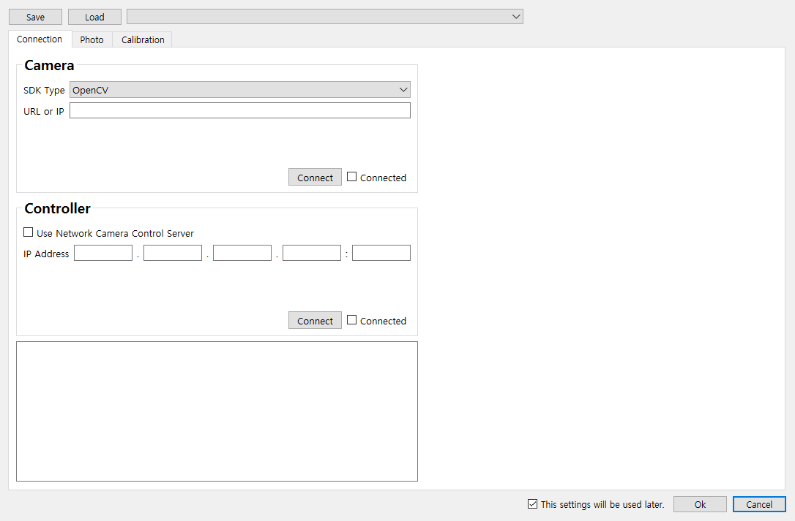
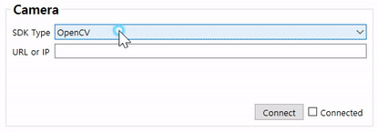
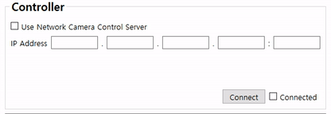
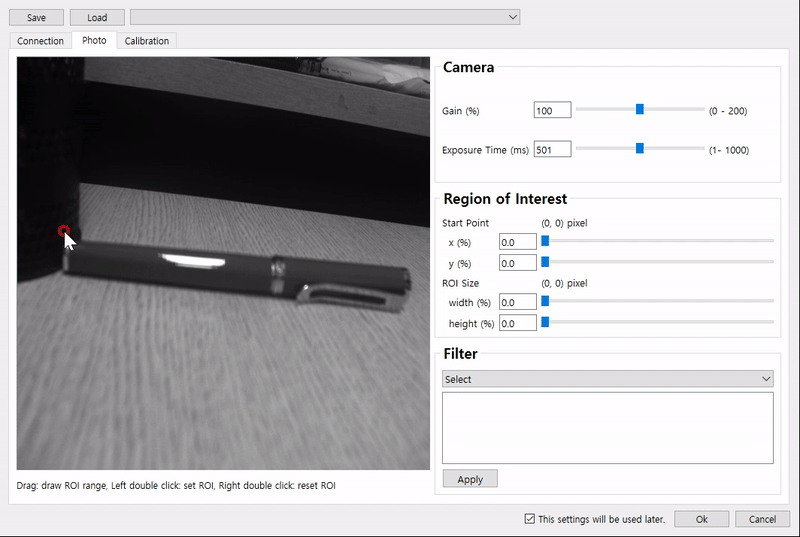
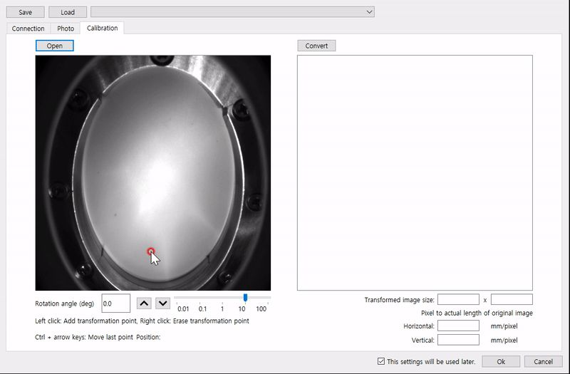
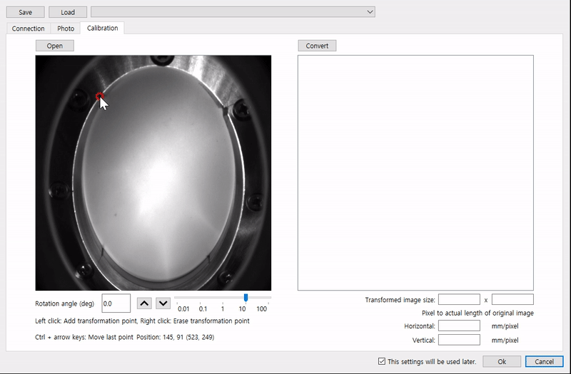
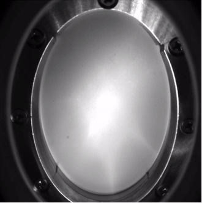
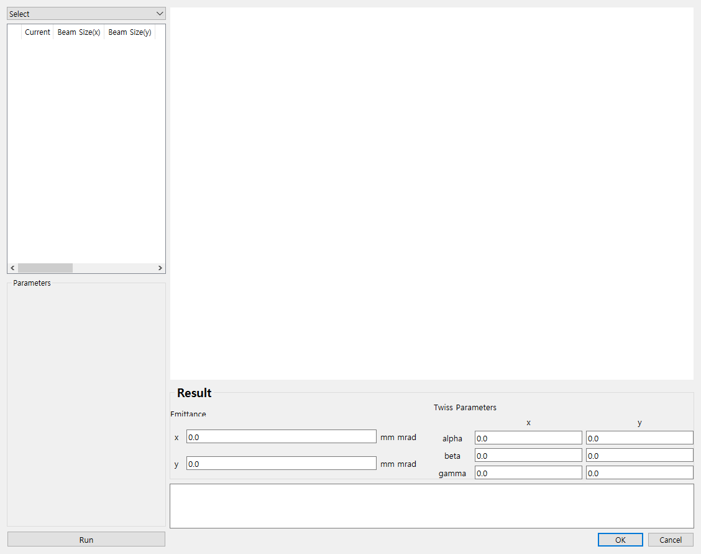
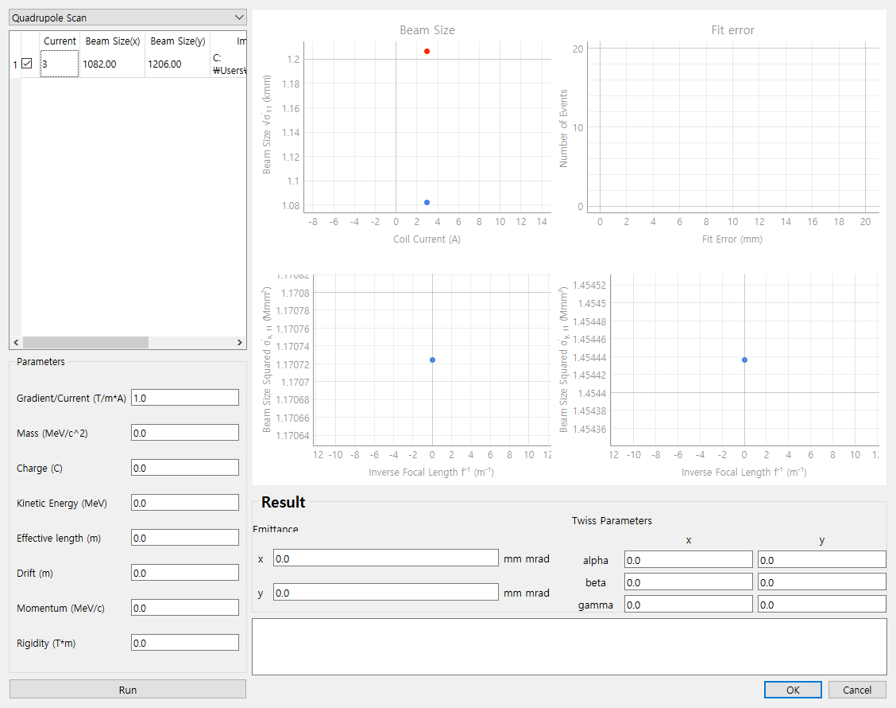

Digital Camera Monitoring System
-------------
Digital Camera Monitoring System(이하 DigiMon)은 카메라를 이용해 빔의 transverse profile을 측정하는 프로그램 입니다.

한국어 설명서: [Korean](https://github.com/Somhammer/DigiMon/blob/master/README_KR.md)

영어 설명서: [English](https://github.com/Somhammer/DigiMon/blob/master/README.md)

### 다운로드와 설치
최신 버전의 프로그램은 저장소의 [release](https://github.com/Somhammer/DigiMon/releases) 란에서 받을 수 있습니다.

만약 운영체제에 맞게 압축파일을 다운로드한 이용할 카메라 회사(Basler, Allied Vision)의 소프트웨어(Pylon, Vimba)를 설치하면 프로그램을 바로 이용할 수 있습니다. 

소스파일을 받은 경우에는 여러 라이브러리들이 추가로 필요합니다.

#### Pylon
DigiMon은 Pylon 6.2.0을 이용했으며 각자의 운영체제에 맞게 [다운로드](https://www.baslerweb.com/ko/sales-support/downloads/software-downloads/) 후 설치를 진행하면 됩니다.

그리고 리눅스의 경우 PYLON_ROOT 환경변수를 등록해야 합니다. 변수의 값은 Pylon이 설치된 경로입니다(예시: /home/seohyeon/pylon)
#### Vimba
DigiMon은 Vimba 5.0을 이용했으며 각자의 운영체제에 맞게 [다운로드](https://www.alliedvision.com/en/products/vimba-sdk/#c1497) 후 설치를 진행하면 됩니다.

그리고 윈도우의 경우 VIMBA_HOME 환경변수를 등록해야 합니다. 변수의 값은 Vimba가 설치된 경로입니다.(예시: C:\Program Files\Allied Vision\Vimba_5.0)

두 소프트웨어가 없어도 프로그램은 실행되지만 해당 회사의 GigE 카메라 연결이 되지 않습니다. 필요한 회사의 소프트웨어를 반드시 설치해주기 바랍니다.

#### 소스파일 설치
만약 소스파일을 다운로드 받아서 이용한다면 Python3.8 이상이 요구됩니다. 그리고 앞의 경우와 마찬가지로 pylon과 vimba가 필요합니다.
또한 다음과 같은 라이브러리들이 추가로 필요합니다.

- PySide6 >= 6.1.2
- pyqtgraph >= 0.12.2
- colour >= 0.1.5
- matplotlib >= 3.4.2
- numpy >= 1.21.1
- scipy >= 1.7.1
- PyYAML >= 5.3.1
- cv2 >= 4.5.3.56
- pypylon >= 1.7.2.dev4
- VimbaPython >= 1.1.0

위 라이브러리들을 pip을 이용해 설치한 뒤 python DigiMon.py를 이용해 실행할 수 있습니다.

### 둘러보기
#### 메인 화면
</img>

1. 카메라 화면

Setup 버튼을 눌러 카메라를 연결하면 카메라 영상이 나타납니다. 영상의 프레임은 조작 패널에서 바꿀 수 있습니다.

2. 실시간 빔 세기

카메라 영상에서 픽셀의 빛의 세기를 보여주는 그래프입니다. 세기를 보여주는 

3. 셋업, 상태

Setup 버튼을 눌러 카메라 연결, 이미지 설정, Calibration을 할 수 있습니다. 버튼 옆 신호는 각각의 상태를 나타냅니다. 
만약 카메라가 성공적으로 연결되었다면 카메라 신호가 초록색으로 바뀝니다.

4. 사진 프로파일

이 창은 사진을 찍으면 찍힌 사진의 프로파일이 나타납니다.

5. 조작
 
Control 패널 안에서 영상의 프레임과 사진을 찍을 때 몇회 반복할 것인지 정할 수 있습니다. 
그리고 Screen의 화살표 버튼들은 왼쪽부터 차례로 왼쪽 90도 회전, 오른쪽 90도 회전, 좌우 반전, 상하 반전, 카메라 줌 인, 아웃 입니다. 
카메라 줌 인, 아웃의 경우 카메라 렌즈를 조작하는 것이 아닌, Controller를 움직이는 방식으로 작동하기 때문에 Controller가 활성화 되어있을 때 사용할 수 있습니다.
그리고 Capture 버튼을 통해 사진을 찍을 수 있으며 Stop 버튼을 통해 중간에 멈출 수 있습니다.

6. 저장된 사진(프로파일)
 
프로파일 패널은 촬영한 사진들의 목록이 표로 기록되며 Emittance 버튼을 눌러 촬영한 사진들을 이용해 emittance를 측정할 수 있습니다.
Open 버튼을 누르면 이전에 저장한 사진을 불러올 수 있습니다.
또한 사진 촬영 당시의 전류를 표에서 수정하거나 사진 촬영 직전에 Current 칸을 수정해 기록할 수 있습니다.

- 카메라가 연결 후의 화면 예시

</img>

#### 셋업

</img>

셋업 버튼을 눌러 창을 띄우면 Connection, Photo, Calibration 세 탭이 나타납니다.

그리고 탭 위에는 Save, Load 버튼과 콤보박스가 있습니다. 셋업을 마치고 Save 버튼을 눌러서 셋업을 저장, Load 버튼을 눌러 이전에 만든 셋업을 불러올 수 있습니다.

또 DigiMon 폴더의 setup 아래에 있는 셋업들은 콤보박스에 저장이 됩니다.

또한 맨 아래의 This settings will be used later 체크박스가 체크되어 있으면 setup 폴더 밑에 last로 저장이 되며, 다음에 콤보박스에서 불러오는 것으로 바로 이용할 수 있습니다.

이제 각각의 탭에 대해 살펴보겠습니다.

Connection 탭은 카메라와 (필요하다면) 원격으로 카메라 위치를 조정하는 장치(NCC에서는 라즈베리 파이에 신호를 받는 서버를 구축, 이하 컨트롤러)를 연결할 수 있습니다.

먼저 카메라의 경우 제품에 맞게 SDK를 선택한 뒤 (OpenCV의 경우 URL을 입력하고) Connect 버튼을 누르면 프로그램이 IP 카메라를 찾아 연결합니다.

연결이 성공할 경우 Connect 체크박스가 체크됩니다.

- 안드로이드 카메라 연결 예시

IP Webcam 앱을 이용하였습니다.

</img>

- Basler CCD 카메라 연결 예시

acA 1600 - 20gm CCD 카메라를 이용하였습니다.

</img>

- Allied Vision 카메라 연결 예시

(테스트 아직 못함)

컨트롤러의 경우 Use Network Camera Control Server 체크박스를 체크하고 IP와 Port 번호를 입력한 뒤 Connection 버튼을 누르면 연결이 됩니다.

</img>

연결이 성공하면 Photo 탭에 카메라로 찍은 사진이 표시됩니다. 그리고 Photo 탭에서 게인, 노출시간, ROI, 필터를 설정할 수 있습니다.

ROI의 경우 이미지 창에서 영역을 클릭, 드래그로 선택하거나 슬라이더를 조절해 선택할 수 있습니다. 만약 ROI 설정이 끝났다면 이미지 더블클릭을 통해 적용할 수 있습니다.

</img>

슬라이더들은 키보드 좌우화살표로 움직일 수 있으며 기본은 0.1%단위로 움직이고 컨트롤 버튼을 누를시 1%, 시프트 버튼을 누를시 10% 단위로 움직입니다.

필터는 원하는 필터를 선택한 뒤 값들을 입력하고 Apply 버튼을 누르면 적용됩니다. 

Calibration 창에서는 기울어진 사진을 회전 또는 투영변환을 통해 기울어짐을 없앨 수 있습니다. 그리고 픽셀 당 실제 거리를 설정해줄 수 있습니다.

Open을 통해 Calibration 용 이미지를 불러오면 사진 아래의 회전각 조절을 통해 이미지를 반시계방향으로 돌릴 수 있습니다.

</img>

그리고 투영변환을 위한 네 점을 찍고 Convert 버튼을 이용해 변환할 수 있습니다. 불러온 이미지에서 찍은 네 점은 변환된 이미지에 그려진 보라색 사각형의 각 꼭지점이 됩니다. 또한 이 사각형의 크기는 Transformed image size 란에서 결정할 수 있습니다. 아무것도 입력하지 않으면 원래 이미지에서 찍은 점 사이의 거리로 결정됩니다(가로는 위쪽의 두 점, 세로는 왼쪽의 두 점).

</img>

투영변환을 위한 점들은 마우스 좌클릭으로 생성, 우클릭으로 삭제할 수 있으며 컨트롤 + 화살표 버튼으로 1픽셀 단위로 움직일 수 있습니다.

</img>

그리고 Calibration까지 마치고 Ok 버튼을 누르면 메인 화면에 카메라 영상이 나타나게 됩니다.

#### 에미턴스

</img>

에미턴스 창에서는 저장된 사진들로 에미턴스를 계산할 수 있습니다. 
먼저 좌측 상단의 Select 콤보 박스에서 사용할 방법을 고릅니다(현재는 quadrupole scan만 구현). 그러면 다음과 같이 입력해야 할 변수들과 그래프가 나타나게 됩니다.

</img>

변수들을 다 입력하고 Run 버튼을 누르면 emittance와 twiss parameter들이 계산됩니다. 만약 계산에 실패하면 아래 로그창에 실패 메세지가 뜨고 값들은 전부 0.0으로 계산됩니다.
