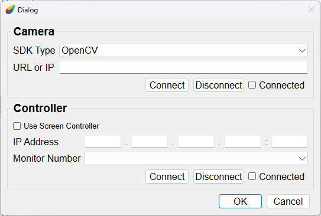
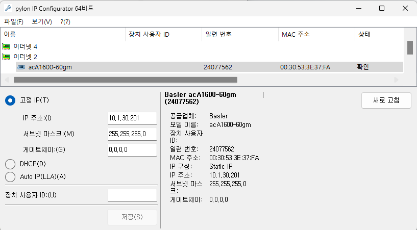
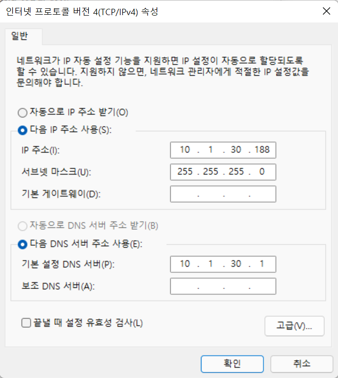
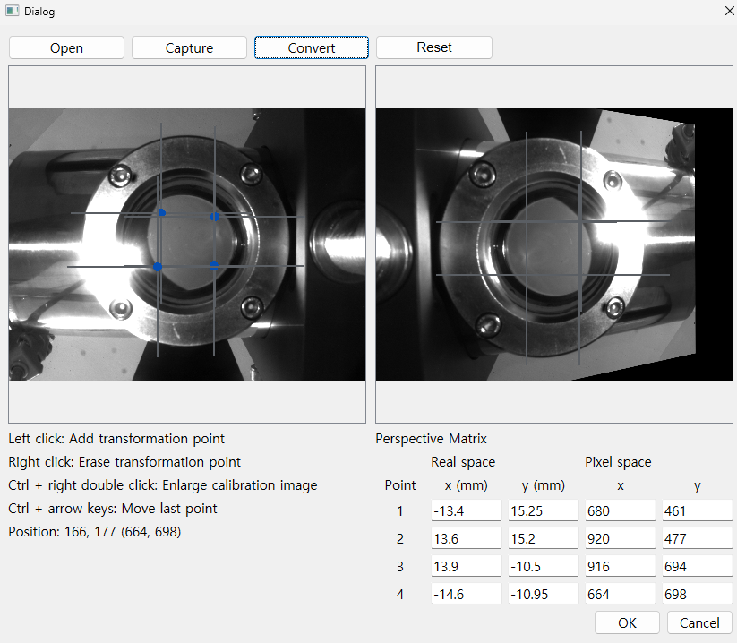
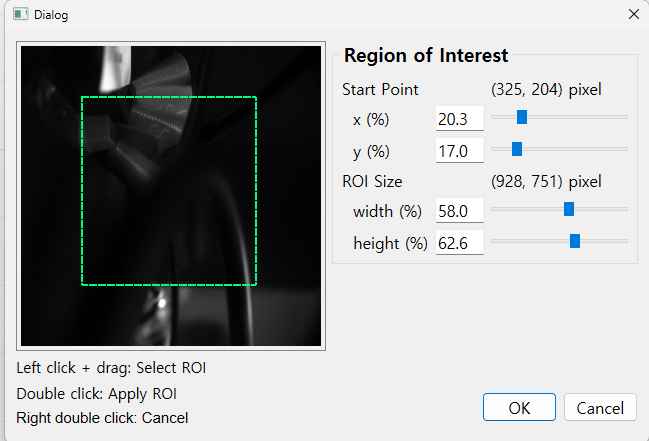
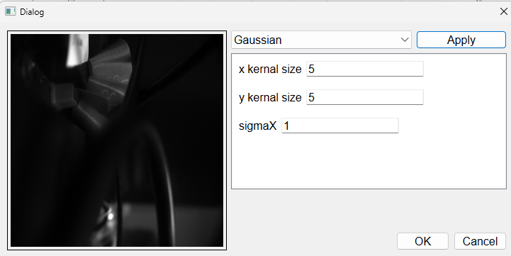

Digital Camera Monitoring System
-------------
Digital Camera Monitoring System(이하 DigiMon)은 카메라를 이용해 빔의 횡단면 프로파을 측정하는 프로그램 입니다.

DigiMon은 OpenCV와 Basler SDK를 지원합니다.

한국어 설명서: [Korean](https://github.com/Somhammer/DigiMon/blob/master/README_KR.md)

영어 설명서: [English](https://github.com/Somhammer/DigiMon/blob/master/README.md)

## 다운로드와 설치
~~최신 버전의 프로그램은 저장소의 [release](https://github.com/Somhammer/DigiMon/releases) 란에서 받을 수 있습니다.~~

~~운영체제에 맞게 다운로드한 다음~~ 이용할 카메라 회사(Basler)의 소프트웨어(Pylon)를 설치하면 프로그램을 바로 이용할 수 있습니다.

또한 GPU 연산을 사용하고 싶은 경우 [CUDA](https://developer.nvidia.com/cuda-downloads)를 추가로 설치해야 합니다.

소스파일을 받은 경우에는 여러 라이브러리들이 추가로 필요합니다.

### Pylon
DigiMon은 Pylon 6.2.0 이상 버전의 설치가 필요합니다. 각자의 운영체제에 맞게 [다운로드](https://www2.baslerweb.com/ko/downloads/software-downloads/) 후 GigE 카메라 소프트웨어를 설치하면 됩니다.

그리고 리눅스의 경우 시스템에 맞게 데비안 인스톨러 또는 gunzip 파일을 받아 시스템에 설치한 다음 PYLON_ROOT 환경변수를 등록해야 합니다. 변수의 값은 Pylon이 설치된 경로입니다(예시: /home/seohyeon/pylon)

소프트웨어가 없어도 프로그램은 실행되지만 Basler 사의 GigE 카메라 연결이 되지 않습니다. 필요한 회사의 소프트웨어를 반드시 설치해주기 바랍니다.

### CUDA
DigiMon은 빔 프로파일 이미지에서 빔의 중심과 크기를 CPU 또는 Nvidia 사의 GPU를 이용해 계산할 수 있는데, GPU를 이용할 경우 CUDA Toolkit이 추가로 필요합니다. [다운로드](https://developer.nvidia.com/cuda-downloads)에서 본인의 운영체제에 맞는 CUDA Toolkit을 받아 설치 하면 됩니다.

### 소스파일 설치
만약 소스파일을 다운로드 받아서 이용한다면 Python3.9 이상이 요구됩니다. 그리고 아래 라이브러리들이 추가로 필요합니다.

- PySide6 >= 6.1.3
- pyqtgraph >= 0.12.2
- colour >= 0.1.5
- matplotlib >= 3.5.0
- numpy >= 1.26.4
- scipy >= 1.7.1
- PyYAML >= 5.3.1
- cv2 >= 4.5.3.56
- pypylon >= 1.7.2.dev4+pylon6.2.0
- caproto >= 0.8.1
- cupy >= 13.0.0

위 라이브러리들을 pip을 이용해 설치한 뒤 python DigiMon.py를 이용해 실행할 수 있습니다.

## 둘러보기

DigiMon은 다음과 같이 사용합니다. Connection 버튼을 누르고 나타나는 다이얼로그에 카메라의 IP 또는 URL을 입력하고 Ok 버튼을 누릅니다. 그러면 상태 창의 카메라 LED가 빨간색으로 점멸되고 가장 왼쪽 창에 영상이 나타납니다. 그리고 Capture 버튼을 누르면 이미지를 촬영하고 빔 프로파일을 분석해 중앙의 화면에 보여줍니다.

다음은 각 구성요소들에 대한 설명입니다.

### 메인 화면
</img>

- 메인 화면은 실시간 화면과 촬영 후 분석한 이미지를 보여주는 화면, 픽셀 값에 대한 히스토그램, 각 요소들의 상태를 나타내주는 창, 카메라와 스크린의 연결 및 동작 제어를 하는 창, 카메라 촬영 조건을 변경하는 창, 이미지 프로세싱에 대한 창, 촬영한 프로파일 이미지의 목록을 보여주는 표, 로그 창이 있습니다.

- 실시간 화면 창은 카메라를 연결할 경우 초록색 십자선과 함께 이미지가 표시됩니다. 초록색 십자선에 있는 픽셀들의 밝기 값은 화면의 위, 오른쪽에 있는 그래프에 표시됩니다. Capture 버튼을 누르면 이미지를 촬영하고 분석 과정을 거친 후 화면 오른쪽의 2차원 그래프에 표시됩니다. 만약 캘리브레이션을 수행했다면 그래프의 각 위치는 픽셀 좌표계가 아닌 실제 좌표계로 표시됩니다. 동시에 2차원 그래프의 아래에 이미지의 중심 좌표 및 빔 크기가 표시됩니다. 화면과 2차원 그래프의 아래에는 밝기값들에 대한 실시간 히스토그램이 표시됩니다.

- 오른쪽 상단의 상태 창은 카메라, 컨트롤러의 연결 상태를 표시해주고 캘리브레이션을 했는지 표시합니다.

- 그 아래의 컨트롤 창에서는 카메라, 컨트롤러를 연결하고 이미지 촬영을 할 수 있습니다. 그리고 섬광체 스크린의 위치를 조절할 수 있습니다.

- 카메라 창에서는 카메라의 게인, 노출시간, 프레임 수를 조절할 수 있습니다.

- 이미지 창에서 사용자는 이미지를 회전할 수 있고, 캘리브레이션, 관심 영역, 필터를 설정할 수 있습니다.

- 그 아래의 표는 촬영한 이미지를 저장하거나 새 이미지를 불러와 분석을 수행할 수 있습니다. 표의 셀을 더블클릭 하는 경우 해당 이미지를 다시 불러옵니다.

#### 카메라, 컨트롤러 연결

</img>

- Connection을 누르면 나타나는 다이얼로그 창은 카메라와 원격으로 섬광체 스크린을 조정하는 장치를 연결할 수 있습니다.

##### 1. 카메라 연결

사용하려는 카메라에 맞게 SDK를 선택하고 IP 또는 URL을 입력한 뒤 Connect 버튼을 누르면 프로그램이 IP 카메라를 찾아 연결합니다.

연결이 성공할 경우 Connect 체크박스가 체크됩니다.

###### - OpenCV

DigiMon은 OpenCV의 VideoCapture를 이용해 URL을 알고 있는 IP 카메라를 이용 할 수 있습니다. 

간단하게는 안드로이드 어플리캐이션 IP Webcam을 이용해 안드로이드 폰의 카메라에 접근할 수 있습니다.

(IP Webcam을 이용하는 경우 어플리케이션에 나타나는 URL에 /video를 붙여야 함)

- Pylon

Pylon을 이용하는 경우 GigE 카메라의 IP 주소를 입력하면 자동으로 연결됩니다.

GigE 카메라를 고정 IP로 연결하기 위해서는 네트워크 어댑터에서 IPv4의 주소를 수동으로 변경해줘야 합니다. 아래는 그 예시 입니다.

-> Pylon Ip Configurator로 확인한 카메라의 고정 IP 주소

</img>

-> 네트워크 어댑터 설정 화면

</img>

2. 컨트롤러 연결

Use Screen Controller에 체크한 후 연결하려는 컨트롤러의 포트를 포함한 IP 주소를 입력한 후 Connect 버튼을 누르면 연결됩니다.

#### 이미지 처리

1. 캘리브레이션

</img>

투영변환을 위한 네 점을 찍고 Convert 버튼을 이용해 변환할 수 있습니다. 불러온 이미지에서 찍은 네 점은 변환된 이미지에 그려진 보라색 사각형의 각 꼭지점이 됩니다. 또한 이 사각형의 크기는 Transformed image size 란에서 결정할 수 있습니다. 아무것도 입력하지 않으면 원래 이미지에서 찍은 점 사이의 거리로 결정됩니다(가로는 위쪽의 두 점, 세로는 왼쪽의 두 점).

투영변환을 위한 점들은 마우스 좌클릭으로 생성, 우클릭으로 삭제할 수 있으며 컨트롤 + 화살표 버튼으로 1픽셀 단위로 움직일 수 있습니다.

그리고 Calibration까지 마치고 Ok 버튼을 누르면 메인 화면에 카메라 영상이 나타나게 됩니다.

2. 관심 영역

</img>

3. 필터

</img>
